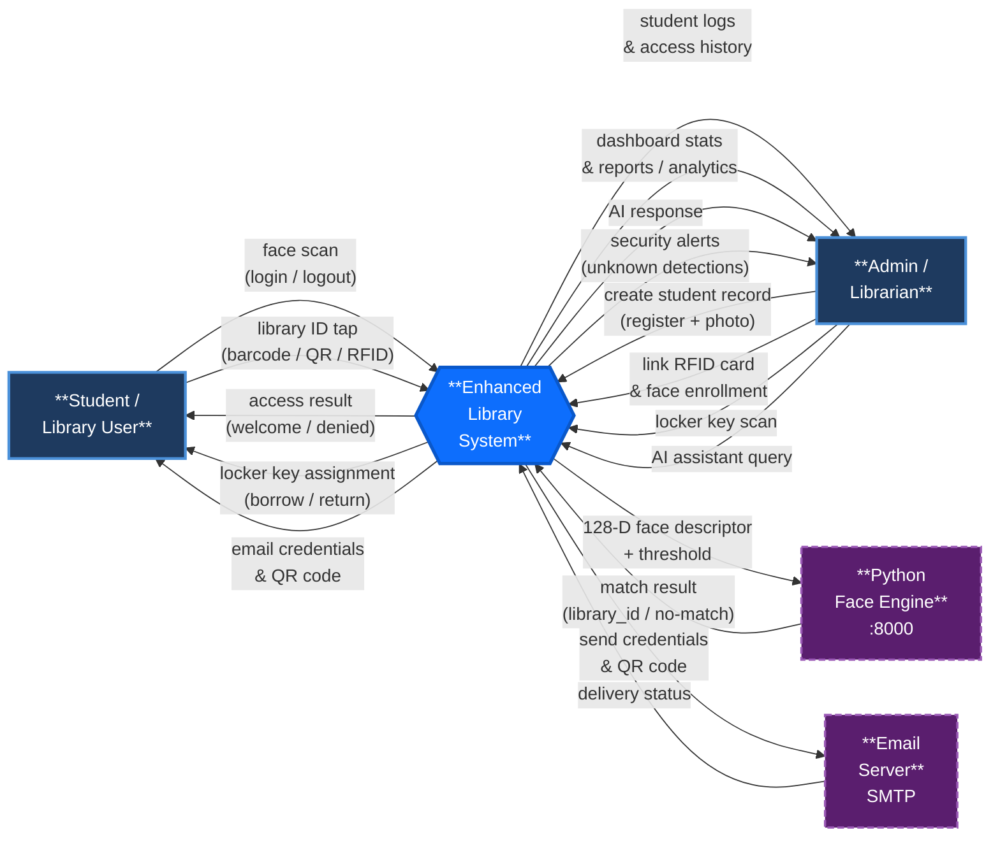

# NAAP Library System — Level 0 DFD (Context Diagram)

> **Level 0 DFD** (Context Diagram) — Shows the entire system as a single process and captures all data flows between the system and its external entities. No internal details are exposed at this level.

---

## Diagram



---

## Key Data Flows

### Student → System
| Flow | Description |
|------|-------------|
| **face scan (login / logout)** | 128-D facial descriptor captured in the browser via face-api.js and submitted to the system |
| **library ID tap (barcode / QR / RFID)** | Student presents their ID at the locker depository to borrow or return a locker key |

### System → Student
| Flow | Description |
|------|-------------|
| **access result (welcome / denied)** | Face recognised → welcome message + time-in/out; unrecognised → denied |
| **locker key assignment** | Confirmation of locker number assigned or returned |
| **email credentials & QR code** | Sent upon registration containing Library ID and scannable QR |

### Admin / Librarian → System
| Flow | Description |
|------|-------------|
| **create student record** | Personal details, course, photo upload, student number |
| **link RFID card & face enrollment** | Assigns physical RFID number and registers 128-D face descriptor |
| **locker key scan** | Scans the physical RFID locker key tag to initiate borrow/return |
| **AI assistant query** | Natural-language question submitted to the AI chat interface |

### System → Admin / Librarian
| Flow | Description |
|------|-------------|
| **student logs & access history** | Real-time and historical login/logout records per student |
| **dashboard stats & reports / analytics** | Count currently-in students, total visits, total enrolled |
| **AI response** | AI-generated reply to the admin's query |
| **security alerts (unknown detections)** | Failed face-recognition attempts flagged for review |

### System ↔ Python Face Engine
| Flow | Description |
|------|-------------|
| **128-D face descriptor + threshold** | POST to `http://127.0.0.1:8000/recognize`; includes configurable Euclidean distance threshold |
| **match result (library_id / no-match)** | Returns matched Library ID + distance score, or a no-match response |

### System ↔ Email Server
| Flow | Description |
|------|-------------|
| **send credentials & QR code** | SMTP dispatch triggered on successful student registration |
| **delivery status** | Success or failure callback used for logging |

---

## Suggestions vs. Original Draft

| Original Label | Suggested Label | Reason |
|----------------|-----------------|--------|
| "log-in/login-out" | **face scan (login / logout)** | More precise — the mechanism is a face scan, not a card/PIN |
| "register face/RFID" from Student | Moved to **Admin → System** | It is the admin/librarian who performs enrollment, not the student themselves |
| "barcode/qr code" ← from Student | **library ID tap (barcode / QR / RFID)** | Clarifies this is a student identity presentation at the locker kiosk |
| *(missing)* | **Python Face Engine** as external entity | The face recognition microservice runs on a separate port (:8000) and is architecturally external |
| *(missing)* | **Email Server** as external entity | SMTP is an external dependency formally part of the context boundary |
| "reports/analytics" | **dashboard stats & reports / analytics** | Specifies real-time stats + historical reporting |
| "AI assistant" | Bidirectional: **query** in + **AI response** out | A flow needs a direction; the query and response are distinct flows |
```
