# NAAP Library System — Level 1 Data Flow Diagram

> **Level 1 DFD** — Expands the system into its major processes and shows how data flows between external entities, processes, and data stores.

---

## Diagram

```mermaid
flowchart TD
    %% ─────────────── EXTERNAL ENTITIES ───────────────
    STU([Student / Library User])
    ADMIN([Administrator / Librarian])
    FACEENG([Python Face Engine<br/>:8000])
    EMAIL([Email Server<br/>SMTP])

    %% ─────────────── DATA STORES ─────────────────────
    DS1[(tbl_student_info<br/>Students)]
    DS2[(tbl_student_logs<br/>Access Logs)]
    DS3[(tbl_access_attempts<br/>Security Attempts)]
    DS4[(tbl_rfid_info<br/>Locker Keys)]
    DS5[(tbl_rfidhistory<br/>Locker Borrow History)]
    DS6[(tbl_sensitivity_thresholds<br/>Recognition Settings)]
    DS7[(users<br/>Admins / Staff)]

    %% ─────────────── PROCESSES ────────────────────────
    P1["P1 — Student Registration\nStudentRegistrationController"]
    P2["P2 — Face Login / Logout\nFaceLoginController"]
    P3["P3 — Face Recognition\nPython FastAPI Service"]
    P4["P4 — Dashboard Monitoring\nDashboardController"]
    P5["P5 — Locker (Depository) Management\nDepositoryController"]
    P6["P6 — Student Management\nStudentController"]
    P7["P7 — AI Assistant\nAiController"]

    %% ═══════════════════════════════════════════════════
    %% P1 — STUDENT REGISTRATION
    %% ═══════════════════════════════════════════════════
    ADMIN -->|"Registration form\n(name, course, photo, RFID, face descriptor)"| P1
    P1 -->|"Create student record"| DS1
    P1 -->|"Store face embedding"| DS1
    P1 -->|"Store RFID card number"| DS1
    P1 -->|"Credential email + QR code"| EMAIL
    EMAIL -->|"QR / credentials delivered"| STU
    P1 -->|"Verification face request\n(128-D descriptor)"| FACEENG
    FACEENG -->|"Match result"| P1

    %% ═══════════════════════════════════════════════════
    %% P2 — FACE LOGIN / LOGOUT
    %% ═══════════════════════════════════════════════════
    STU -->|"Face scan\n(128-D descriptor + capture image)"| P2
    P2 -->|"Identify face\n(descriptor + threshold)"| P3
    P3 -->|"Match / No-match result\n(library_id, distance)"| P2
    P2 <-->|"Read threshold setting"| DS6
    P2 -->|"Read student record"| DS1
    P2 -->|"Write login / logout entry"| DS2
    P2 -->|"Write access attempt\n(success or failed)"| DS3
    P2 -->|"Read active locker check\n(block logout if key not returned)"| DS5
    P2 -->|"Login / Logout result"| STU

    %% ═══════════════════════════════════════════════════
    %% P3 — FACE RECOGNITION (Python Face Engine)
    %% ═══════════════════════════════════════════════════
    P3 <-->|"Fetch all face embeddings\n(LIBRARY_ID + FACE_EMBEDDING)"| DS1
    FACEENG <-->|"Internal: P3 is the Face Engine"| P3

    %% ═══════════════════════════════════════════════════
    %% P4 — DASHBOARD MONITORING
    %% ═══════════════════════════════════════════════════
    ADMIN -->|"View dashboard request"| P4
    P4 <-->|"Read today's logs\n(login/logout entries)"| DS2
    P4 <-->|"Read failed attempts\n(unknown detections)"| DS3
    P4 <-->|"Read student count"| DS1
    P4 -->|"Dashboard stats + log feed"| ADMIN

    %% ═══════════════════════════════════════════════════
    %% P5 — LOCKER / DEPOSITORY MANAGEMENT
    %% ═══════════════════════════════════════════════════
    ADMIN -->|"Scan locker RFID key\n(rfid_card_number)"| P5
    STU -->|"Tap Library ID\n(RFID / QR / Barcode)"| P5
    P5 <-->|"Read / update locker key availability"| DS4
    P5 <-->|"Create / update borrow record"| DS5
    P5 <-->|"Verify student is logged in"| DS2
    P5 <-->|"Read student info"| DS1
    P5 -->|"Assign / Return confirmation"| ADMIN
    P5 -->|"Locker result"| STU

    %% ═══════════════════════════════════════════════════
    %% P6 — STUDENT MANAGEMENT
    %% ═══════════════════════════════════════════════════
    ADMIN -->|"Search / Edit / Delete student"| P6
    P6 <-->|"Read / update / delete student record"| DS1
    P6 -->|"Notification email"| EMAIL
    P6 -->|"Student list / result"| ADMIN

    %% ═══════════════════════════════════════════════════
    %% P7 — AI ASSISTANT
    %% ═══════════════════════════════════════════════════
    ADMIN -->|"Chat query"| P7
    P7 -->|"AI response"| ADMIN

    %% ─────────────── STYLE ────────────────────────────
    classDef entity    fill:#1e3a5f,color:#fff,stroke:#4a90d9,stroke-width:2px,rx:40
    classDef process   fill:#0d6efd,color:#fff,stroke:#0a58ca,stroke-width:2px
    classDef datastore fill:#198754,color:#fff,stroke:#146c43,stroke-width:2px
    classDef external  fill:#6f42c1,color:#fff,stroke:#59359a,stroke-width:2px

    class STU,ADMIN entity
    class FACEENG,EMAIL external
    class P1,P2,P3,P4,P5,P6,P7 process
    class DS1,DS2,DS3,DS4,DS5,DS6,DS7 datastore
```



---

## Process Descriptions

| Process | Name | Controller | Description |
|---------|------|------------|-------------|
| **P1** | Student Registration | `StudentRegistrationController` | Registers new students, links RFID cards, enrolls face descriptors, generates Library ID (YY-NNNNN), and sends QR credentials via email. |
| **P2** | Face Login / Logout | `FaceLoginController` | Accepts a 128-D face descriptor from the browser, delegates recognition to the Python engine, records the access log, and enforces locker-return rules before logout. |
| **P3** | Face Recognition Engine | `face_engine/main.py` (FastAPI) | Fetches all stored face embeddings from the DB, computes Euclidean distance against the submitted descriptor, and returns the best-matching Library ID if below the threshold. |
| **P4** | Dashboard Monitoring | `DashboardController` | Aggregates today's login/logout logs, counts currently-present students, and surfaces failed/unknown access attempts for security review. |
| **P5** | Locker Management | `DepositoryController` | Two-step RFID flow: staff scans the locker key → student taps their Library ID. Handles borrow and return, enforces library-login prerequisite, and prevents dual-borrowing. |
| **P6** | Student Management | `StudentController` | Allows admins to search, edit, delete students and send notification emails. |
| **P7** | AI Assistant | `AiController` | Provides an AI chat interface for administrators (internal queries). |

---

## Data Stores

| Store | Table | Key Data |
|-------|-------|----------|
| **DS1** | `tbl_student_info` | LIBRARY_ID, name, course, photo, RFID number, face embedding, QR sent flag |
| **DS2** | `tbl_student_logs` | LIBRARY_ID, LOG_DATE, LOG_TIME, LOG_SESSION, LOG_IMAGE |
| **DS3** | `tbl_access_attempts` | LIBRARY_ID (nullable), STATUS, ATTEMPT_TYPE (login/logout), IMAGE_PATH |
| **DS4** | `tbl_rfid_info` | RFID_NUMBER, LOCKER_NUMBER, IS_AVAILABLE |
| **DS5** | `tbl_rfidhistory` | RFID_CARD_NUMBER, LIBRARY_ID, BORROW_ON, RETURN_ON, LOCKER_NUMBER |
| **DS6** | `tbl_sensitivity_thresholds` | key=face_recognition, value (Euclidean threshold, default 0.45) |
| **DS7** | `users` | Admin / staff accounts (Laravel Jetstream / Fortify) |

---

## External Entities

| Entity | Role |
|--------|------|
| **Student / Library User** | Performs face login/logout, borrows/returns lockers, receives QR credentials |
| **Administrator / Librarian** | Registers students, manages lockers, monitors dashboard, uses AI assistant |
| **Python Face Engine (:8000)** | FastAPI microservice performing face embedding matching via Euclidean distance |
| **Email Server (SMTP)** | Delivers student credentials and QR codes upon registration |
```
