# NAAP Library System — Entity Relationship Diagram

> **ERD** — Depicts all tables, their columns, and relationships (both enforced FK constraints and hardcoded application-level joins).
> Hardcoded relationships are marked `[HC]`. Formally enforced FK constraints are marked `[FK]`.

*Last updated: 2026-04-16 — reflects migrations: email_messages, tbl_lost_id_reports, change_is_available_to_string, survey_tables*

---

## Diagram

```mermaid
erDiagram

    %% ─────────────── AUTH / SYSTEM TABLES ───────────────

    users {
        bigint id PK
        varchar name
        varchar email
        timestamp email_verified_at
        varchar password
        text two_factor_secret
        text two_factor_recovery_codes
        timestamp two_factor_confirmed_at
        varchar remember_token
        timestamp created_at
        timestamp updated_at
    }

    sessions {
        varchar id PK
        bigint user_id FK
        varchar ip_address
        text user_agent
        longtext payload
        int last_activity
    }

    password_reset_tokens {
        varchar email PK
        varchar token
        timestamp created_at
    }

    %% ─────────────── STUDENT TABLES ─────────────────────

    tbl_student_info {
        varchar LIBRARY_ID PK
        varchar STUDENT_RFID_NUMBER
        varchar STUDENT_NUMBER
        varchar FN
        varchar MN
        varchar LN
        varchar SEX
        varchar BIRTHDAY
        varchar CONTACT_NUMBER
        varchar EMAIL
        tinyint QR_SENT
        varchar PIC
        varchar COURSE
        varchar ADDRESS
        date REGISTERED_ON
        date RENEW_ON
        varchar ID_STATUS
        date ID_STATUS_DATE
        json FACE_EMBEDDING
    }

    tbl_student_logs {
        bigint id PK
        varchar LIBRARY_ID FK
        time LOG_TIME
        date LOG_DATE
        varchar LOG_SESSION
        varchar LOG_IMAGE
    }

    tbl_access_attempts {
        bigint id PK
        varchar LIBRARY_ID FK
        enum STATUS
        varchar IMAGE_PATH
        varchar ATTEMPT_TYPE
        date LOG_DATE
        time LOG_TIME
        timestamp created_at
        timestamp updated_at
    }

    %% ─────────────── LOCKER / DEPOSITORY TABLES ─────────

    tbl_rfid_info {
        varchar RFID_NUMBER PK
        int LOCKER_NUMBER
        varchar IS_AVAILABLE
    }

    tbl_rfidhistory {
        bigint id PK
        varchar RFID_CARD_NUMBER FK
        varchar LIBRARY_ID FK
        datetime BORROW_ON
        datetime RETURN_ON
        varchar LOCKER_NUMBER
        varchar EMP_ID FK
    }

    %% ─────────────── REPORTS / COMMUNICATION ─────────────

    tbl_lost_id_reports {
        bigint id PK
        varchar old_library_id
        varchar new_library_id
        varchar student_number
        varchar location_lost
        text description
        varchar affidavit_path
        bigint processed_by FK
        timestamp created_at
        timestamp updated_at
    }

    email_messages {
        bigint id PK
        varchar library_id FK
        varchar subject
        longtext body
        varchar attachments
        varchar sent_to
        boolean is_read
        timestamp created_at
        timestamp updated_at
    }

    %% ─────────────── SURVEY TABLES ───────────────────────

    surveys {
        bigint id PK
        varchar title
        text description
        enum status
        bigint created_by FK
        timestamp created_at
        timestamp updated_at
    }

    survey_questions {
        bigint id PK
        bigint survey_id FK
        int order
        enum type
        text label
        json options
        boolean required
        timestamp created_at
        timestamp updated_at
    }

    survey_responses {
        bigint id PK
        bigint survey_id FK
        varchar respondent_name
        varchar respondent_email
        json answers
        timestamp submitted_at
    }

    %% ─────────────── CONFIGURATION TABLES ───────────────

    tbl_sensitivity_thresholds {
        bigint id PK
        varchar key
        decimal value
        varchar description
        timestamp created_at
        timestamp updated_at
    }

    tbl_settings {
        bigint id PK
        varchar key
        text value
        varchar description
        timestamp created_at
        timestamp updated_at
    }

    %% ─────────────── LARAVEL QUEUE / CACHE TABLES ───────

    jobs {
        bigint id PK
        varchar queue
        longtext payload
        tinyint attempts
        int reserved_at
        int available_at
        int created_at
    }

    job_batches {
        varchar id PK
        varchar name
        int total_jobs
        int pending_jobs
        int failed_jobs
        longtext failed_job_ids
        mediumtext options
        int cancelled_at
        int created_at
        int finished_at
    }

    failed_jobs {
        bigint id PK
        varchar uuid
        text connection
        text queue
        longtext payload
        longtext exception
        timestamp failed_at
    }

    cache {
        varchar key PK
        mediumtext value
        int expiration
    }

    cache_locks {
        varchar key PK
        varchar owner
        int expiration
    }

    migrations {
        int id PK
        varchar migration
        int batch
    }

    %% ═══════════════════════════════════════════════════
    %% RELATIONSHIPS
    %% ═══════════════════════════════════════════════════

    %% [FK] Auth
    users ||--o{ sessions : "id → user_id"

    %% [HC] Student core
    tbl_student_info ||--o{ tbl_student_logs : "LIBRARY_ID → LIBRARY_ID"
    tbl_student_info ||--o{ tbl_access_attempts : "LIBRARY_ID → LIBRARY_ID (nullable)"

    %% [HC] Depository
    tbl_student_info ||--o{ tbl_rfidhistory : "LIBRARY_ID → LIBRARY_ID"
    tbl_rfid_info    ||--o{ tbl_rfidhistory : "RFID_NUMBER → RFID_CARD_NUMBER"
    users            ||--o{ tbl_rfidhistory : "id → EMP_ID (staff)"

    %% [FK] Lost ID reports
    users ||--o{ tbl_lost_id_reports : "id → processed_by"

    %% [HC] Email messages
    tbl_student_info ||--o{ email_messages : "LIBRARY_ID → library_id (nullable)"

    %% [HC] Surveys — created_by
    users ||--o{ surveys : "id → created_by"

    %% [FK] Survey structure (CASCADE DELETE)
    surveys ||--o{ survey_questions : "id → survey_id"
    surveys ||--o{ survey_responses : "id → survey_id"
```

---

## Relationship Summary

| # | Parent Table | Parent Key | Child Table | Child Key | Type | Enforced |
|---|---|---|---|---|---|---|
| 1 | `users` | `id` | `sessions` | `user_id` | One-to-Many | **[FK]** Laravel default |
| 2 | `tbl_student_info` | `LIBRARY_ID` | `tbl_student_logs` | `LIBRARY_ID` | One-to-Many | **[HC]** Hardcoded |
| 3 | `tbl_student_info` | `LIBRARY_ID` | `tbl_access_attempts` | `LIBRARY_ID` | One-to-Many (nullable) | **[HC]** Hardcoded |
| 4 | `tbl_student_info` | `LIBRARY_ID` | `tbl_rfidhistory` | `LIBRARY_ID` | One-to-Many | **[HC]** Hardcoded |
| 5 | `tbl_rfid_info` | `RFID_NUMBER` | `tbl_rfidhistory` | `RFID_CARD_NUMBER` | One-to-Many | **[HC]** Hardcoded |
| 6 | `users` | `id` | `tbl_rfidhistory` | `EMP_ID` | One-to-Many | **[HC]** Hardcoded |
| 7 | `users` | `id` | `tbl_lost_id_reports` | `processed_by` | One-to-Many | **[FK]** Constrained |
| 8 | `tbl_student_info` | `LIBRARY_ID` | `email_messages` | `library_id` | One-to-Many (nullable) | **[HC]** Hardcoded |
| 9 | `users` | `id` | `surveys` | `created_by` | One-to-Many | **[HC]** Hardcoded |
| 10 | `surveys` | `id` | `survey_questions` | `survey_id` | One-to-Many | **[FK]** CASCADE DELETE |
| 11 | `surveys` | `id` | `survey_responses` | `survey_id` | One-to-Many | **[FK]** CASCADE DELETE |

---

## Notes

- **[HC] Hardcoded** relationships exist as application-level joins (in controllers/queries) but have **no formal `FOREIGN KEY` constraint** in the database migrations.
- **[FK] Constrained** relationships have actual database-enforced foreign keys.
- `tbl_access_attempts.LIBRARY_ID` is **nullable** — `null` means an unknown/unrecognized face (no matching student found).
- `tbl_rfidhistory.EMP_ID` stores `auth()->id()` cast as `varchar`, pointing to `users.id` (bigint).
- `tbl_rfidhistory.RETURN_ON` being `NULL` means the locker key is **currently borrowed**.
- `tbl_rfidhistory.LOCKER_NUMBER` is denormalized from `tbl_rfid_info` at borrow-time for historical accuracy.
- `tbl_rfid_info.IS_AVAILABLE` was changed from `tinyint` to `varchar` (`'Yes'` / `'No'`) — migration `2026_04_16_000000`.
- `tbl_student_info.STUDENT_RFID_NUMBER` is the **student's own ID card RFID**, separate from `tbl_rfid_info` which stores **locker key RFIDs**.
- `email_messages.library_id` is nullable — messages can exist without a linked student (e.g. bulk or system emails).
- `surveys.created_by` and `email_messages.library_id` have no DB-level FK constraint — enforced by application logic only.
- `survey_questions` and `survey_responses` cascade-delete when their parent `survey` is deleted.
- `tbl_sensitivity_thresholds` and `tbl_settings` are standalone configuration tables with no FK relationships.
