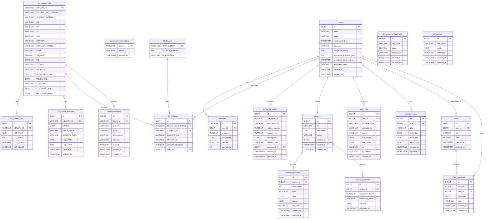

```mermaid
erDiagram
    users {
        BIGINT id PK
        VARCHAR name
        VARCHAR email
        TIMESTAMP email_verified_at
        VARCHAR password
        TEXT two_factor_secret
        TEXT two_factor_recovery_codes
        TIMESTAMP two_factor_confirmed_at
        VARCHAR remember_token
        TIMESTAMP created_at
        TIMESTAMP updated_at
    }
    sessions {
        VARCHAR id PK
        BIGINT user_id FK
        VARCHAR ip_address
        TEXT user_agent
        LONGTEXT payload
        INT last_activity
    }
    password_reset_tokens {
        VARCHAR email PK
        VARCHAR token
        TIMESTAMP created_at
    }
    tbl_student_info {
        VARCHAR LIBRARY_ID PK
        VARCHAR STUDENT_RFID_NUMBER
        VARCHAR STUDENT_NUMBER
        VARCHAR FN
        VARCHAR MN
        VARCHAR LN
        VARCHAR SEX
        VARCHAR BIRTHDAY
        VARCHAR CONTACT_NUMBER
        VARCHAR EMAIL
        TINYINT QR_SENT
        VARCHAR PIC
        VARCHAR COURSE
        VARCHAR ADDRESS
        DATE REGISTERED_ON
        DATE RENEW_ON
        VARCHAR ID_STATUS
        DATE ID_STATUS_DATE
        JSON FACE_EMBEDDING
    }
    tbl_student_logs {
        BIGINT id PK
        VARCHAR LIBRARY_ID FK
        TIME LOG_TIME
        DATE LOG_DATE
        VARCHAR LOG_SESSION
        VARCHAR LOG_IMAGE
    }
    tbl_access_attempts {
        BIGINT id PK
        VARCHAR LIBRARY_ID FK
        ENUM STATUS
        VARCHAR IMAGE_PATH
        VARCHAR ATTEMPT_TYPE
        DATE LOG_DATE
        TIME LOG_TIME
        TIMESTAMP created_at
        TIMESTAMP updated_at
    }
    tbl_rfid_info {
        VARCHAR RFID_NUMBER PK
        INT LOCKER_NUMBER
        VARCHAR IS_AVAILABLE
    }
    tbl_rfidhistory {
        BIGINT id PK
        VARCHAR RFID_CARD_NUMBER FK
        VARCHAR LIBRARY_ID FK
        DATETIME BORROW_ON
        DATETIME RETURN_ON
        VARCHAR LOCKER_NUMBER
        BIGINT EMP_ID FK
    }
    tbl_lost_id_reports {
        BIGINT id PK
        VARCHAR old_library_id
        VARCHAR new_library_id
        VARCHAR student_number
        VARCHAR location_lost
        TEXT description
        VARCHAR affidavit_path
        BIGINT processed_by FK
        TIMESTAMP created_at
        TIMESTAMP updated_at
    }
    email_messages {
        BIGINT id PK
        VARCHAR library_id FK
        VARCHAR subject
        LONGTEXT body
        VARCHAR attachments
        VARCHAR sent_to
        BOOLEAN is_read
        TIMESTAMP created_at
        TIMESTAMP updated_at
    }
    surveys {
        BIGINT id PK
        VARCHAR title
        TEXT description
        VARCHAR status
        BIGINT created_by FK
        TIMESTAMP created_at
        TIMESTAMP updated_at
    }
    survey_questions {
        BIGINT id PK
        BIGINT survey_id FK
        INT order_index
        VARCHAR type
        TEXT label
        JSON options
        BOOLEAN required
        TIMESTAMP created_at
        TIMESTAMP updated_at
    }
    survey_responses {
        BIGINT id PK
        BIGINT survey_id FK
        VARCHAR respondent_name
        VARCHAR respondent_email
        JSON answers
        TIMESTAMP submitted_at
    }
    tbl_sensitivity_thresholds {
        BIGINT id PK
        VARCHAR key_name
        DECIMAL value
        VARCHAR description
        TIMESTAMP created_at
        TIMESTAMP updated_at
    }
    tbl_settings {
        BIGINT id PK
        VARCHAR key_name
        TEXT value
        VARCHAR description
        TIMESTAMP created_at
        TIMESTAMP updated_at
    }
    audit_trails {
        BIGINT id PK
        BIGINT user_id FK
        VARCHAR auditable_type
        VARCHAR auditable_id
        VARCHAR event
        JSON old_values
        JSON new_values
        VARCHAR url
        VARCHAR ip_address
        TIMESTAMP created_at
    }
    calendar_notes {
        BIGINT id PK
        BIGINT user_id FK
        VARCHAR title
        DATE note_date
        TIME note_time
        TEXT description
        TIMESTAMP created_at
        TIMESTAMP updated_at
    }
    chats {
        BIGINT id PK
        BIGINT user_id FK
        VARCHAR title
        VARCHAR status
        TIMESTAMP created_at
        TIMESTAMP updated_at
    }
    chat_messages {
        BIGINT id PK
        BIGINT chat_id FK
        BIGINT user_id FK
        TEXT message
        VARCHAR role
        TIMESTAMP created_at
        TIMESTAMP updated_at
    }

    users ||--o{ sessions : "has"
    users ||--o{ tbl_rfidhistory : "processes"
    users ||--o{ tbl_lost_id_reports : "processes"
    users ||--o{ surveys : "creates"
    users ||--o{ audit_trails : "generates"
    users ||--o{ calendar_notes : "has"
    users ||--o{ chats : "participates_in"
    users ||--o{ chat_messages : "sends"
    
    tbl_student_info ||--o{ tbl_student_logs : "has"
    tbl_student_info ||--o{ tbl_access_attempts : "has"
    tbl_student_info ||--o{ tbl_rfidhistory : "borrows"
    tbl_student_info ||--o{ email_messages : "receives"
    
    tbl_rfid_info ||--o{ tbl_rfidhistory : "has"
    
    surveys ||--o{ survey_questions : "contains"
    surveys ||--o{ survey_responses : "receives"
    
    chats ||--o{ chat_messages : "contains"
```
