# NAAP Library System — Logical Database Diagram

> **Logical ERD** — Depicts all tables, their columns, data types, and relationships.
> Relationships marked **[HC]** are hardcoded at the application level (no formal FK constraint in migrations).
> Relationships marked **[FK]** are formally enforced by a database foreign key constraint.

*Last updated: 2026-04-16*

---

## Diagram

```mermaid
erDiagram

    %% ═══════════════════════════════════════════════════════
    %% AUTH / USER TABLES
    %% ═══════════════════════════════════════════════════════

    users {
        bigint  id                      PK
        varchar name
        varchar email
        timestamp email_verified_at
        varchar password
        text    two_factor_secret
        text    two_factor_recovery_codes
        timestamp two_factor_confirmed_at
        varchar remember_token
        timestamp created_at
        timestamp updated_at
    }

    sessions {
        varchar  id             PK
        bigint   user_id        FK
        varchar  ip_address
        text     user_agent
        longtext payload
        int      last_activity
    }

    password_reset_tokens {
        varchar   email         PK
        varchar   token
        timestamp created_at
    }

    %% ═══════════════════════════════════════════════════════
    %% STUDENT TABLES
    %% ═══════════════════════════════════════════════════════

    tbl_student_info {
        varchar LIBRARY_ID          PK "Format: YY-NNNNN"
        varchar STUDENT_RFID_NUMBER     "Student ID card RFID (not locker key)"
        varchar STUDENT_NUMBER
        varchar FN                      "First Name"
        varchar MN                      "Middle Name"
        varchar LN                      "Last Name"
        varchar SEX
        varchar BIRTHDAY
        varchar CONTACT_NUMBER
        varchar EMAIL
        tinyint QR_SENT                 "0=not sent, 1=sent"
        varchar PIC
        varchar COURSE
        varchar ADDRESS
        date    REGISTERED_ON
        date    RENEW_ON
        varchar ID_STATUS               "Active | Expired"
        date    ID_STATUS_DATE
        json    FACE_EMBEDDING          "128-D descriptors per angle"
    }

    tbl_student_logs {
        bigint  id              PK
        varchar LIBRARY_ID      FK
        time    LOG_TIME
        date    LOG_DATE
        varchar LOG_SESSION         "Unix timestamp — pairs in/out rows"
        varchar LOG_IMAGE
    }

    tbl_access_attempts {
        bigint  id              PK
        varchar LIBRARY_ID      FK  "Nullable — NULL = unknown face"
        enum    STATUS              "success | failed"
        varchar IMAGE_PATH
        varchar ATTEMPT_TYPE        "login | logout"
        date    LOG_DATE
        time    LOG_TIME
        timestamp created_at
        timestamp updated_at
    }

    %% ═══════════════════════════════════════════════════════
    %% LOCKER / DEPOSITORY TABLES
    %% ═══════════════════════════════════════════════════════

    tbl_rfid_info {
        varchar RFID_NUMBER     PK  "Physical RFID tag on the locker KEY"
        int     LOCKER_NUMBER       "Auto-incremented locker number"
        varchar IS_AVAILABLE        "Yes | No"
    }

    tbl_rfidhistory {
        bigint   id             PK
        varchar  RFID_CARD_NUMBER   FK  "→ tbl_rfid_info.RFID_NUMBER"
        varchar  LIBRARY_ID         FK  "→ tbl_student_info.LIBRARY_ID"
        datetime BORROW_ON
        datetime RETURN_ON              "NULL = key currently borrowed"
        varchar  LOCKER_NUMBER          "Denormalized at borrow-time"
        varchar  EMP_ID             FK  "→ users.id (cast to string)"
    }

    %% ═══════════════════════════════════════════════════════
    %% LOST ID REPORTS
    %% ═══════════════════════════════════════════════════════

    tbl_lost_id_reports {
        bigint  id              PK
        varchar old_library_id
        varchar new_library_id      "Nullable — filled after replacement"
        varchar student_number
        varchar location_lost
        text    description
        varchar affidavit_path
        bigint  processed_by    FK  "→ users.id"
        timestamp created_at
        timestamp updated_at
    }

    %% ═══════════════════════════════════════════════════════
    %% EMAIL MESSAGES
    %% ═══════════════════════════════════════════════════════

    email_messages {
        bigint   id             PK
        varchar  library_id         "Nullable — [HC] → tbl_student_info.LIBRARY_ID"
        varchar  subject
        longtext body
        varchar  attachments        "Nullable"
        varchar  sent_to            "Nullable"
        boolean  is_read
        timestamp created_at
        timestamp updated_at
    }

    %% ═══════════════════════════════════════════════════════
    %% SURVEY TABLES
    %% ═══════════════════════════════════════════════════════

    surveys {
        bigint  id              PK
        varchar title
        text    description
        enum    status              "draft | active | closed"
        bigint  created_by          "[HC] → users.id"
        timestamp created_at
        timestamp updated_at
    }

    survey_questions {
        bigint  id              PK
        bigint  survey_id       FK  "→ surveys.id (CASCADE DELETE)"
        int     order
        enum    type                "short_text | paragraph | multiple_choice | checkboxes | dropdown | rating | date"
        text    label
        json    options             "Nullable — for choice-based types"
        boolean required
        timestamp created_at
        timestamp updated_at
    }

    survey_responses {
        bigint    id            PK
        bigint    survey_id     FK  "→ surveys.id (CASCADE DELETE)"
        varchar   respondent_name   "Nullable"
        varchar   respondent_email  "Nullable"
        json      answers           "{ question_id: answer }"
        timestamp submitted_at
    }

    %% ═══════════════════════════════════════════════════════
    %% CONFIGURATION TABLES
    %% ═══════════════════════════════════════════════════════

    tbl_sensitivity_thresholds {
        bigint  id              PK
        varchar key
        decimal value               "Euclidean distance threshold"
        varchar description
        timestamp created_at
        timestamp updated_at
    }

    tbl_settings {
        bigint  id              PK
        varchar key
        text    value
        varchar description
        timestamp created_at
        timestamp updated_at
    }

    %% ═══════════════════════════════════════════════════════
    %% LARAVEL QUEUE / CACHE / SYSTEM TABLES
    %% ═══════════════════════════════════════════════════════

    jobs {
        bigint   id             PK
        varchar  queue
        longtext payload
        tinyint  attempts
        int      reserved_at
        int      available_at
        int      created_at
    }

    job_batches {
        varchar   id            PK
        varchar   name
        int       total_jobs
        int       pending_jobs
        int       failed_jobs
        longtext  failed_job_ids
        mediumtext options
        int       cancelled_at
        int       created_at
        int       finished_at
    }

    failed_jobs {
        bigint   id             PK
        varchar  uuid
        text     connection
        text     queue
        longtext payload
        longtext exception
        timestamp failed_at
    }

    cache {
        varchar    key          PK
        mediumtext value
        int        expiration
    }

    cache_locks {
        varchar key             PK
        varchar owner
        int     expiration
    }

    migrations {
        int     id              PK
        varchar migration
        int     batch
    }

    %% ═══════════════════════════════════════════════════════
    %% RELATIONSHIPS
    %% ═══════════════════════════════════════════════════════

    %% [FK] Auth
    users ||--o{ sessions : "id → user_id"

    %% [HC] Student core
    tbl_student_info ||--o{ tbl_student_logs : "LIBRARY_ID → LIBRARY_ID"
    tbl_student_info ||--o{ tbl_access_attempts : "LIBRARY_ID → LIBRARY_ID (nullable)"

    %% [HC] Depository / Locker
    tbl_student_info ||--o{ tbl_rfidhistory : "LIBRARY_ID → LIBRARY_ID"
    tbl_rfid_info    ||--o{ tbl_rfidhistory : "RFID_NUMBER → RFID_CARD_NUMBER"
    users            ||--o{ tbl_rfidhistory : "id → EMP_ID (staff)"

    %% [FK] Lost ID reports
    users ||--o{ tbl_lost_id_reports : "id → processed_by"

    %% [HC] Email messages
    tbl_student_info ||--o{ email_messages : "LIBRARY_ID → library_id (nullable)"

    %% [HC] Surveys — created_by
    users ||--o{ surveys : "id → created_by"

    %% [FK] Survey structure
    surveys ||--o{ survey_questions : "id → survey_id (CASCADE)"
    surveys ||--o{ survey_responses : "id → survey_id (CASCADE)"
```

---

## Relationship Summary

| # | Parent Table | Parent Key | Child Table | Child Key | Enforcement |
|---|---|---|---|---|---|
| 1 | `users` | `id` | `sessions` | `user_id` | **FK** (Laravel default) |
| 2 | `tbl_student_info` | `LIBRARY_ID` | `tbl_student_logs` | `LIBRARY_ID` | **HC** Hardcoded |
| 3 | `tbl_student_info` | `LIBRARY_ID` | `tbl_access_attempts` | `LIBRARY_ID` | **HC** Hardcoded (nullable) |
| 4 | `tbl_student_info` | `LIBRARY_ID` | `tbl_rfidhistory` | `LIBRARY_ID` | **HC** Hardcoded |
| 5 | `tbl_rfid_info` | `RFID_NUMBER` | `tbl_rfidhistory` | `RFID_CARD_NUMBER` | **HC** Hardcoded |
| 6 | `users` | `id` | `tbl_rfidhistory` | `EMP_ID` | **HC** Hardcoded (string cast) |
| 7 | `users` | `id` | `tbl_lost_id_reports` | `processed_by` | **FK** Constrained |
| 8 | `tbl_student_info` | `LIBRARY_ID` | `email_messages` | `library_id` | **HC** Hardcoded (nullable) |
| 9 | `users` | `id` | `surveys` | `created_by` | **HC** Hardcoded |
| 10 | `surveys` | `id` | `survey_questions` | `survey_id` | **FK** Constrained (CASCADE) |
| 11 | `surveys` | `id` | `survey_responses` | `survey_id` | **FK** Constrained (CASCADE) |

---

## Table Groups

| Group | Tables |
|---|---|
| **Auth / User** | `users`, `sessions`, `password_reset_tokens` |
| **Student** | `tbl_student_info`, `tbl_student_logs`, `tbl_access_attempts` |
| **Depository** | `tbl_rfid_info`, `tbl_rfidhistory` |
| **Reports** | `tbl_lost_id_reports`, `email_messages` |
| **Survey** | `surveys`, `survey_questions`, `survey_responses` |
| **Configuration** | `tbl_sensitivity_thresholds`, `tbl_settings` |
| **Laravel System** | `jobs`, `job_batches`, `failed_jobs`, `cache`, `cache_locks`, `migrations` |

---

## Schema Notes

- **[HC] Hardcoded** relationships exist as application-level joins (in controllers/queries) but have **no formal `FOREIGN KEY` constraint** in the migrations.
- **[FK] Constrained** relationships have actual database-enforced foreign keys.
- `tbl_access_attempts.LIBRARY_ID` is **nullable** — `null` means an unknown/unrecognized face with no matching student.
- `tbl_rfidhistory.EMP_ID` stores `auth()->id()` cast as `varchar`, pointing to `users.id` (bigint).
- `tbl_rfidhistory.RETURN_ON` being `NULL` means the locker key is **currently borrowed**.
- `tbl_rfidhistory.LOCKER_NUMBER` is **denormalized** from `tbl_rfid_info` at borrow-time to preserve historical accuracy if lockers are reassigned.
- `tbl_rfid_info.IS_AVAILABLE` was changed from `tinyint` to `varchar` (`'Yes'` / `'No'`).
- `tbl_student_info.STUDENT_RFID_NUMBER` is the **student's own ID card RFID**, entirely separate from `tbl_rfid_info` which holds **locker key RFIDs**.
- `survey_questions` and `survey_responses` cascade-delete when their parent `survey` is deleted.
- `email_messages.library_id` is nullable — messages can exist without a linked student (e.g. bulk or system emails).
- `tbl_sensitivity_thresholds` and `tbl_settings` are standalone configuration tables with no FK relationships.
