# NAAP Library System — System Architecture Overview

> **System Architecture Diagram** — Illustrates the 3-Tier Modular Architecture of the Integrated Library Management System (ILMS) deployed at the National Aviation Academy of the Philippines. This covers all components, technologies, inter-service communications, and data domains.

---

## Architecture Diagram

```mermaid
flowchart TD
    %% ══════════════════════════════════════════════════════════
    %% TIER 1: PRESENTATION LAYER
    %% ══════════════════════════════════════════════════════════
    subgraph P ["🖥️  PRESENTATION LAYER — React + Inertia.js (Browser-Based SPA)"]
        direction LR
        subgraph AdminUI ["👤 Admin / Staff Interface"]
            direction TB
            A1["Dashboard & Real-Time Monitoring"]
            A2["Student Registry & Records"]
            A3["Locker Depository Management"]
            A4["Surveys & Feedback"]
            A5["Lost ID Reporting"]
            A6["Email Notifications"]
            A7["Announcements"]
            A8["AI Chat Interface"]
            A9["System Settings & Config"]
            A10["Audit Trails & Calendar Notes"]
        end

        subgraph Terminal ["🏛️ Library Entry Terminal (Kiosk)"]
            direction TB
            T1["face-api.js\n128-D Face Descriptor\n(Client-Side Capture)"]
            T2["RFID Reader"]
            T3["QR Code Scanner"]
            T4["Barcode Scanner"]
        end
    end

    %% ══════════════════════════════════════════════════════════
    %% TIER 2: APPLICATION LOGIC LAYER
    %% ══════════════════════════════════════════════════════════
    subgraph L ["⚙️  APPLICATION LOGIC LAYER"]
        direction LR
        subgraph Laravel ["🐘 Laravel 11 — Core Application Server"]
            direction TB
            L1["Controller-Service-Repository Pattern"]
            L2["Session-Based Login/Logout Detection\n(Odd/Even Parity Rule)"]
            L3["Locker-Return Gate Rule"]
            L4["Staff Auth — Jetstream + 2FA"]
            L5["Audit Trail Logging"]
        end

        subgraph FaceEngine ["🐍 Python FastAPI Microservice\n(Port 8000)"]
            direction TB
            F1["Euclidean Distance Matching\nd(p,q) = √Σᵢ(pᵢ−qᵢ)²"]
            F2["Threshold: 0.45 (configurable)"]
            F3["Returns: Library ID Match"]
        end

        subgraph SMTP ["✉️ SMTP Email Gateway"]
            direction TB
            S1["Student Credentials Dispatch"]
            S2["QR Code Delivery"]
            S3["Custom Notifications"]
        end

        subgraph AI ["🤖 AI Assistant"]
            direction TB
            AI1["Ollama — Local / Offline LLM"]
            AI2["Cloud AI Provider (configurable)"]
            AI3["Custom System Prompt"]
        end
    end

    %% ══════════════════════════════════════════════════════════
    %% TIER 3: DATA LAYER
    %% ══════════════════════════════════════════════════════════
    subgraph D ["🗄️  DATA LAYER — MySQL Relational Database (Eloquent ORM)"]
        direction LR
        subgraph StudentDomain ["Student Domain"]
            D1["tbl_student_info\n(LIBRARY_ID PK, FACE_EMBEDDING JSON, RFID)"]
            D2["tbl_student_logs\n(Session Attendance)"]
            D3["tbl_access_attempts\n(Security Audit + Photos)"]
        end
        subgraph LockerDomain ["Locker Domain"]
            D4["tbl_rfid_info\n(Key Inventory)"]
            D5["tbl_rfidhistory\n(Borrow / Return Log)"]
        end
        subgraph CommDomain ["Communication"]
            D6["email_messages"]
            D7["tbl_lost_id_reports"]
        end
        subgraph FeedbackDomain ["Feedback"]
            D8["surveys"]
            D9["survey_questions"]
            D10["survey_responses"]
        end
        subgraph ChatDomain ["AI Chat"]
            D11["chats"]
            D12["chat_messages\n(role: user|assistant|system)"]
        end
        subgraph SysDomain ["System"]
            D13["tbl_sensitivity_thresholds"]
            D14["tbl_settings"]
            D15["calendar_notes"]
        end
        subgraph AuthDomain ["Auth"]
            D16["users (Jetstream)"]
            D17["sessions"]
        end
        subgraph ImmutableDomain ["🔒 Immutable (DB Triggers)"]
            D18["audit_trails\n⛔ NO UPDATE | NO DELETE"]
        end
    end

    %% ══════════════════════════════════════════════════════════
    %% CONNECTIONS
    %% ══════════════════════════════════════════════════════════
    AdminUI  -- "Inertia.js / HTTP" --> Laravel
    Terminal -- "HTTP API\n(face descriptor / RFID tap)" --> Laravel
    Laravel  -- "Internal HTTP\n(128-D descriptor forward)" --> FaceEngine
    FaceEngine -- "Match Result\n(Library ID)" --> Laravel
    Laravel  -- "SMTP / Mail" --> SMTP
    Laravel  -- "API / Ollama HTTP" --> AI
    Laravel  <-- "Eloquent ORM\n(Read / Write)" --> D
    FaceEngine -- "Read: FACE_EMBEDDING" --> StudentDomain

    %% ══════════════════════════════════════════════════════════
    %% STYLES
    %% ══════════════════════════════════════════════════════════
    classDef presentation fill:#1e3a5f,stroke:#3b82f6,color:#fff,stroke-width:2px
    classDef terminal fill:#134e4a,stroke:#14b8a6,color:#fff,stroke-width:2px
    classDef logic fill:#2e1065,stroke:#6366f1,color:#fff,stroke-width:2px
    classDef faceengine fill:#431407,stroke:#f97316,color:#fff,stroke-width:2px
    classDef smtp fill:#083344,stroke:#06b6d4,color:#fff,stroke-width:2px
    classDef ai fill:#3b0764,stroke:#a855f7,color:#fff,stroke-width:2px
    classDef data fill:#052e16,stroke:#22c55e,color:#fff,stroke-width:2px
    classDef immutable fill:#450a0a,stroke:#ef4444,color:#fff,stroke-width:2px

    class AdminUI presentation
    class Terminal terminal
    class Laravel logic
    class FaceEngine faceengine
    class SMTP smtp
    class AI ai
    class StudentDomain,LockerDomain,CommDomain,FeedbackDomain,ChatDomain,SysDomain,AuthDomain data
    class ImmutableDomain immutable
```

---

## Architecture Summary Table

| Layer | Component | Technology |
|---|---|---|
| **Presentation** | Admin / Staff Web Interface | React + Inertia.js (Hybrid SPA) |
| **Presentation** | Library Entry Terminal / Kiosk | Browser + face-api.js |
| **Application Logic** | Core Application Server | Laravel 11 (PHP) — CSR Pattern |
| **Application Logic** | Face Recognition Microservice | Python 3 + FastAPI (Port 8000) |
| **Application Logic** | Email Service | Configurable SMTP |
| **Application Logic** | AI Assistant | Ollama (local) or Cloud AI API |
| **Data** | Relational Database | MySQL (Eloquent ORM) |
| **Cross-Layer** | Authentication | Laravel Jetstream + 2FA |
| **Cross-Layer** | Audit Logging | Immutable `audit_trails` (DB Triggers) |
| — | Deployment | Local Institutional Server |
| — | SDLC Methodology | Modified Waterfall |
| — | Quality Standard | ISO 25010 |
| — | Acceptance Model | Technology Acceptance Model (TAM) |

## Key Algorithmic Logic

### 1. Session-Based Login/Logout Detection (Parity Rule)
> Count of `tbl_student_logs` entries for a student on the current date:
> - **ODD count** → student is outside → record a **Login**
> - **EVEN count** → student is inside → record a **Logout**

This stateless approach eliminates the need for a separate `status` column.

### 2. Face Recognition: Euclidean Distance Matching
> **d(p, q) = √ Σᵢ (pᵢ − qᵢ)²**
>
> - `p` = submitted 128-D face descriptor (from browser via face-api.js)
> - `q` = stored face embedding per enrolled student (5 angles)
> - Threshold: **0.45** (configurable via `tbl_sensitivity_thresholds`)

If the closest match distance is **below** the threshold → access granted.

### 3. Locker-Return Gate Rule
> A student **cannot log out** of the library if `tbl_rfidhistory` contains an active borrow record (`RETURN_ON IS NULL`) for their `LIBRARY_ID`.
