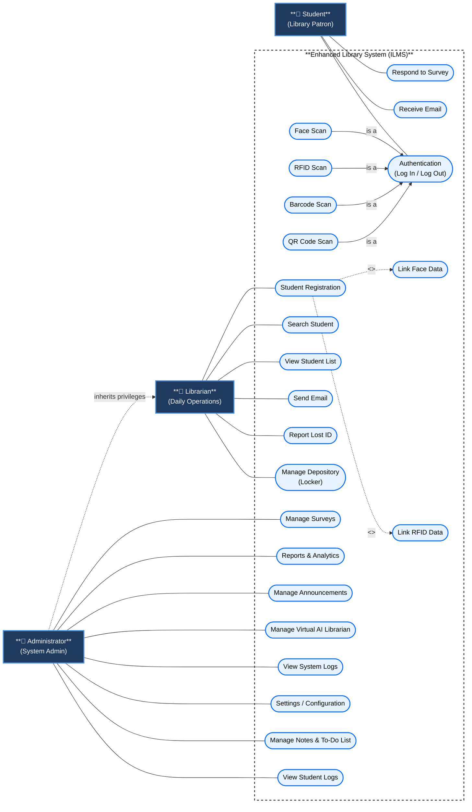

# NAAP Library System — Use Case Diagram

> **Use Case Diagram** — Illustrates the interactions between the system's actors and the various functions (use cases) provided by the Integrated Library Management System (ILMS). This version expands upon previous iterations to explicitly include detailed system modules (e.g., all login methods, linking biometrics, announcements) while strictly adhering to UML standards and role-based access.

---

## Diagram

---

## Actors & Responsibilities

| Actor | Description |
|---|---|
| **Student (Patron)** | The primary end-user who interacts with the system via access terminals and interfaces to access library services. |
| **Librarian** | Operational staff member responsible for daily library transactions, student enrollment, communication, and manual operations. |
| **Administrator** | Highest authority user with full access to configuration, data analytics, overall system maintenance, and AI integration. Inherits all Librarian capabilities. |

## Use Case Descriptions

### Student Use Cases
- **Respond to Survey**: Providing feedback through active surveys published by the administration.
- **Receive Email**: Receiving automated system notifications, QR codes, and credentials.
- **Authentication (Log In / Log Out)**: General authentication into the library.
  - *Face Scan*: Authenticate using facial recognition.
  - *RFID Scan*: Authenticate using an assigned physical RFID card/token.
  - *Barcode Scan*: Authenticate using a legacy ID barcode.
  - *QR Code Scan*: Authenticate using a dynamically generated QR code.

### Librarian Use Cases
- **Student Registration**: Enrolling new students into the library system.
  - *`<<include>>` Link Face Data*: Capturing and registering the student's biometric data.
  - *`<<include>>` Link RFID Data*: Assigning a physical RFID token to the student's record.
- **Search Student**: Querying the database to find specific student records.
- **View Student List**: Accessing a paginated directory of registered students.
- **Send Email**: Manually dispatching or triggering email communications to students.
- **Report Lost ID**: Flagging an RFID/Barcode as lost and unlinking it to prevent unauthorized access.
- **Manage Depository**: Handling locker key assignments, claims, and returns.

### Administrator Use Cases
- **Manage Surveys**: Creating, editing, and publishing feedback surveys for students.
- **Reports & Analytics**: Generating statistical reports on attendance, system usage, and inventory.
- **Manage Announcements**: Creating public service broadcasts or library updates.
- **Manage Virtual AI Librarian**: Querying, tuning, and monitoring the system's integrated AI chatbot.
- **View System Logs**: Reviewing application-wide event logs and audit trails for security and debugging.
- **Settings / Configuration**: Adjusting global system thresholds (e.g., facial recognition confidence), API keys, and configurations.
- **Manage Notes & To-Do List**: Adding and maintaining internal administrative tasks or calendar events.
- **View Student Logs**: Detailed monitoring of individual student access histories.
